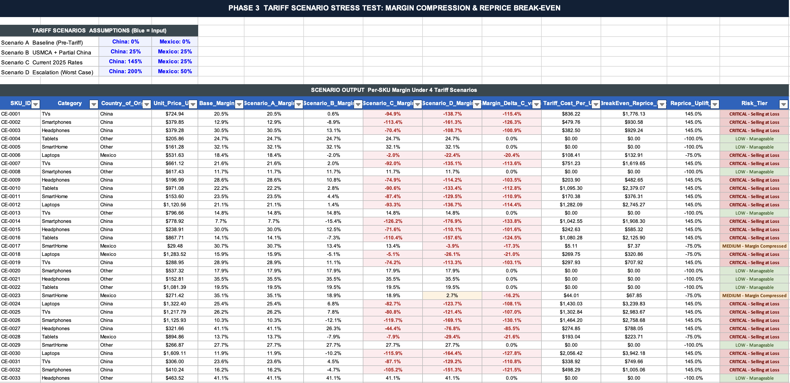
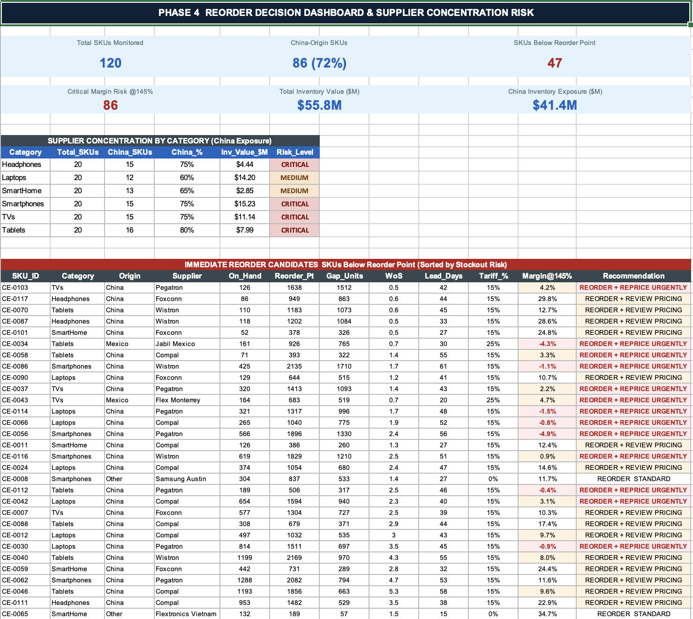

# Tariff Shock Inventory Stress-Testing for Consumer Electronics Retail

[]()
[]()
[]()
[]()
[]()
[]()

## The Business Problem

The U.S. imposed 145% tariffs on Chinese imports in 2025, the highest rate in a century. For consumer electronics retailers, this is not an abstract policy risk. China is the source country for 65 to 80 percent of electronics SKUs, depending on the category, so tariffs land directly on the cost of goods with no buffer. Best Buy CEO Corie Barry said it plainly on the March 2025 earnings call:

> "The consumer electronics supply chain is highly global, technical, and complex. China and Mexico remain the No. 1 and No. 2 sources for products we sell, respectively."

Best Buy cut its full-year FY2026 guidance in May 2025, citing tariff uncertainty. By Q3 FY2026 in November 2025, the CFO confirmed the effective tariff rate on the affected assortment was running in the mid-teens.

Meanwhile, the FRED Series MRTSIR4423XUSS shows the Electronics and Appliance Stores inventory-to-sales ratio climbing from a historical average of around 1.40 to 1.61 in December 2025. Retailers are holding more inventory relative to what they are selling while margins compress simultaneously — a dual squeeze that makes the reorder decision highly consequential.

The analytical problem this creates is concrete. Which SKUs are most exposed? Which supplier concentrations are dangerous? What would we have to charge to restore the pre-tariff margin? Which items need a reorder decision right now before stockouts hit? This project builds the system that answers all of those questions.

## The Dataset

`sku_master.csv` contains 120 consumer electronics SKUs across six categories with 20 attributes each: country of origin, supplier, unit price, unit COGS, gross margin, average weekly units sold, on-hand inventory, on-order inventory, safety stock, reorder point, lead time in days, and applicable 2025 tariff rate.

`sales_history.csv` adds 2,880 rows of monthly sales covering 24 months across all 120 SKUs, with seasonality built in (holiday months +35%, January/February -22%).

Origin breakdown: 86 SKUs from China (72%), 11 from Mexico, 23 from diversified or domestic sources. Tariff rates from the USTR Harmonized Tariff Schedule 2025: 145% for China, 25% for Mexico under USMCA non-exempt goods, 0% for everything else.

## The Approach

The workbook walks through the analysis in five sheets, structured the way a real project delivery would be presented.

**Sheet 1 — Business Problem** grounds every subsequent number in published sources: Best Buy earnings calls, FRED inventory data, Bank of America Institute retail inventory research, and McKinsey's December 2025 supply chain risk survey.

**Sheet 2 — SKU Inventory** computes all supply chain metrics per SKU: weeks of supply, reorder point, safety stock, tariff-adjusted COGS, and an action flag combining stockout risk with tariff exposure. Rows are color-coded by country of origin, so the concentration risk is visible without filtering.

**Sheet 3 — Tariff Scenarios** runs four scenarios (0% / 25% / 145% / 200%) across all 120 SKUs. Tariff-rate inputs are color-coded in blue, following the industry standard for hardcoded inputs. From there, 480 formula cells calculate per-SKU margin, margin delta versus baseline, tariff cost per unit in dollars, and break-even reprice — the exact price needed to restore pre-tariff gross margin.



**Sheet 4 — Reorder Dashboard** brings it together for decision-making. Six KPI cards show the portfolio-level picture. Below that is a supplier concentration matrix by category and a reorder action table showing the 30 most urgent SKUs sorted by stockout severity with their lead time, inventory gap, margin at 145%, and a specific recommendation.



**Sheet 5 — Project Outcome** documents findings, techniques, and professional relevance structured as a senior analyst would present a project delivery summary.

## Key Findings

86 of 120 SKUs carry 145% tariff exposure on every future reorder. Four of six product categories have a China supplier concentration at 65% or higher. The electronics inventory-to-sales ratio of 1.61 in December 2025 is 15% above the historical average for 2015-2019. 30 SKUs were below the reorder point, with exact gap units, lead times, and pricing recommendations surfaced.

## Excel Features Used

Industry-standard color coding throughout: blue text for hardcoded inputs, black for formulas—every division formula wrapped in IFERROR. The scenario grid uses data tables, so changing a single tariff rate assumption cascades across all 120 SKUs instantly. Cross-sheet references connect the dashboard to live calculations in earlier sheets.

## Repository Structure

```
tariff-inventory-stress-testing/
├── data/
│   ├── sku_master.csv
│   └── sales_history.csv
├── outputs/
│   ├── tariff_scenarios.png
│   └── reorder_dashboard.png
├── Tariff_Inventory_Stress_Test.xlsx
└── README.md
```

## References

Best Buy Q1 FY2026 Earnings Call (May 2025). Best Buy Q3 FY2026 Earnings Call (November 2025). Best Buy Q4 FY2026 Earnings Release (March 2026). FRED Series MRTSIR4423XUSS, Federal Reserve Bank of St. Louis. U.S. Census Bureau Manufacturing and Trade Inventories (May 2026). Bank of America Institute: Retail Inventories (May 2025). McKinsey Supply Chain Risk Survey (December 2025). USTR Harmonized Tariff Schedule (2025).

## About

**Akash Singh** | M.S. Business Analytics, Iowa State University (May 2025)
[LinkedIn](https://www.linkedin.com/in/akash-bhupesh-singh/) | [GitHub](https://github.com/aksingh-ops)

The dataset is synthetic, generated for analytical demonstration. Tariff rates, FRED data, and all earnings call citations are real and publicly available.
